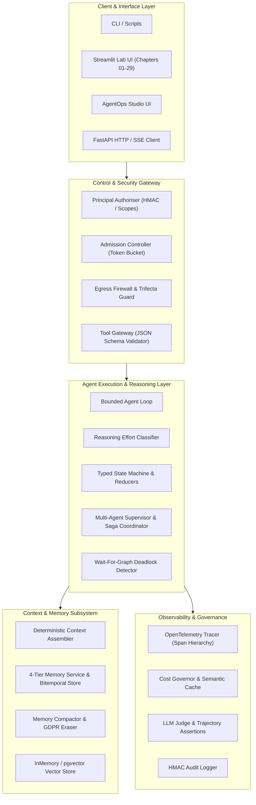

# Technical Documentation: `agentic-ai-lab`

> **Single Source of Truth**: This technical documentation is generated strictly from the verified source code, schemas, and configurations within the `agentic-ai-lab` repository.

---

## 1. Overview

`agentic-ai-lab` is an enterprise-grade reference implementation and interactive laboratory for production Agentic AI systems. It provides executable, mathematically grounded Python implementations for every architectural pattern required to build, govern, observe, and scale multi-agent distributed systems.

### Problem Solved
LLM applications often fail in production when treated as simple conversational prompts. `agentic-ai-lab` treats agents as **distributed, deterministic control systems** whose policy function happens to be probabilistic. It addresses:
- Unbounded execution loops and runaway API costs.
- Distributed failure recovery (Saga compensations, circuit breakers, degradation ladders).
- Memory leakage, privacy compliance (GDPR Art. 17 hard erasure), and bitemporal valid-time filtering.
- Multi-agent coordination deadlocks, handoff budget depletion, and untrusted execution containment.

### Main Capabilities
- **Bounded Control Loops**: Explicit stopping bounds (steps, cost, wall-clock time, goal satisfaction).
- **6-Component Reference Architecture**: Environment, State, Context, Policy, Gateway, and Telemetry.
- **Enterprise Protocol Implementations**: FastMCP (Model Context Protocol) with cryptographic hash pinning and A2A (Agent-to-Agent) task lifecycles.
- **Production Guardrails**: Lethal trifecta prevention, cryptographic provenance tracking, egress firewalls, and sub-process sandboxing.
- **Production Capstone (`AgentOps Studio`)**: A multi-agent research platform with typed state machines, content-addressed ingestion, and HMAC-authenticated API gateways.

### Primary Technologies
- **Runtime & Language**: Python 3.11+ / 3.13
- **Web UI & Visualization**: Streamlit (>= 1.38.0)
- **Validation & Schemas**: Pydantic (>= 2.7.0), JSON Schema (`jsonschema`)
- **Telemetry & Tracing**: OpenTelemetry SDK & API (>= 1.25.0), OTLP Collector
- **Protocols & Interop**: FastMCP (`mcp` >= 1.0.0), JSON-RPC 2.0
- **Database & Storage**: PostgreSQL 16 + `pgvector`, InMemoryVectorStore fallback
- **Testing**: Pytest (>= 8.0.0), `pytest-asyncio`

---

## 2. Architecture

The system is structured into a modular tiered architecture where foundational primitives compose into higher-order multi-agent networks and production platform infrastructure.



### Component Boundaries
1. **Shared Foundation (`shared/`)**: Provides settings configuration, Ollama/deterministic model client fallback, in-memory multi-tenant vector storage, and lightweight OpenTelemetry tracing.
2. **Modular Topic Chapters (`chapter_01` to `chapter_29`)**: Self-contained implementations of specific patterns (e.g. `BoundedAgentLoop`, `ToolGateway`, `MemoryService`, `Supervisor`, `CircuitBreaker`).
3. **Enterprise Platform Capstone (`agentops/`)**: Integrates all patterns into a multi-agent system with typed state transitions, ingestion pipelines, release gating, and authorization.

---

## 3. Repository Structure

```text
agentic-ai-lab/
├── .env.example                     # Environment variable template
├── .gitignore                       # Git ignore definitions
├── LICENSE                          # Project license
├── README.md                        # Overview and lab app navigation index
├── pytest.ini                       # Pytest configuration (asyncio mode, pythonpath)
├── requirements.txt                 # Pinned dependencies
├── agentops/                        # Capstone: Enterprise AgentOps Studio
│   ├── api/
│   │   └── authz.py                 # Principal authorization, HMAC tokens, role scopes
│   ├── app.py                       # Streamlit UI for AgentOps Studio
│   ├── core/
│   │   └── state.py                 # Typed state machine, reducers, phase lifecycle
│   ├── eval/
│   │   └── gate.py                  # Statistical release gate & trajectory scoring
│   ├── graph/
│   │   └── build.py                 # Multi-agent execution graph builder
│   ├── ingest/
│   │   └── pipeline.py              # Content-addressed chunking & embedding pipeline
│   └── tools/
│       └── registry.py              # Scoped tool registration & execution sandbox
├── chapter_01/ to chapter_29/       # Chapter modules & Streamlit interactive labs
│   ├── chapter_01/bounded_loop.py   # Control loop & termination bounds
│   ├── chapter_02/design_console.py # Reference architecture & degradation ladder
│   ├── chapter_03/reasoning_router.py# Complexity classifier & ReWOO planner
│   ├── chapter_04/durable_graph.py  # Event-sourced workflow engine & replay
│   ├── chapter_05/tool_gateway.py   # Tool gateway & JSON Schema validation
│   ├── chapter_06/context_assembler.py # Token budgeting & deterministic assembly
│   ├── chapter_07/memory_service.py # Bitemporal memory, GDPR GC & compaction
│   ├── chapter_08/skill_library.py  # Dynamic exemplar selection & promotion gate
│   ├── chapter_09/supervisor.py     # Supervisor, Saga coordinator & deadlock detector
│   ├── chapter_10/protocols.py      # FastMCP client with pinning & A2A tasks
│   ├── chapter_11/agent_console.py  # SSE event streaming & human intervention
│   ├── chapter_12/eval_harness.py   # Trajectory assertions & pairwise judge
│   ├── chapter_13/telemetry.py      # OTel spans, tail sampling & cost attribution
│   ├── chapter_14/cost_lab.py       # Semantic answer cache & FinOps governor
│   ├── chapter_15/improvement_loop.py# Failure triage & regression test generation
│   ├── chapter_16/defenses.py       # Lethal trifecta guard & provenance firewall
│   ├── chapter_17/responsible_ai.py # Disparate impact & refusal calibration
│   ├── chapter_18/governance.py     # SLA escalation router & authority matrix
│   ├── chapter_19/computer_use.py   # Vision perception ladder & coordinate mapping
│   ├── chapter_20/edge_agent.py     # Local-first routing & bandwidth estimator
│   ├── chapter_21/coding_agent.py   # AST repository localiser & patch integrity
│   ├── chapter_22/agentic_retrieval.py # Adaptive retrieval policy & document grading
│   ├── chapter_23/patterns.py       # Sliding window circuit breaker & outbox
│   ├── chapter_24/scale_lab.py      # Token bucket limiter & admission control
│   ├── chapter_25/case_studies.py   # Production telemetry case studies
│   ├── chapter_27/drills.py         # Coding drills: typed retry, RRF, stream parser
│   ├── chapter_28/design_drills.py  # 45-minute system design simulator
│   └── chapter_29/story_bank.py     # STAR behavioral story bank evaluator
├── deploy/                          # Containerization & Infrastructure
│   ├── app.py                       # Deployment entrypoint
│   └── docker-compose.yml           # Multi-service local production topology
├── scripts/                         # Operational Scripts
│   ├── check_book_parity.py         # AST parser checking book-to-code parity
│   └── run_tests.sh                 # Unit & parity test suite runner
├── shared/                          # Shared Infrastructure
│   ├── config.py                    # Settings & environment variables
│   ├── db_utils.py                  # InMemoryVectorStore & DocumentChunk
│   ├── models.py                    # LocalModelClient (Ollama + offline fallback)
│   ├── streamlit_utils.py           # Shared UI widgets and styling
│   └── telemetry.py                 # Span & Tracer implementations
└── tests/                           # Test Suites
    └── unit/                        # Unit tests for all chapters and shared modules
